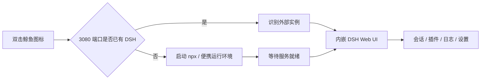
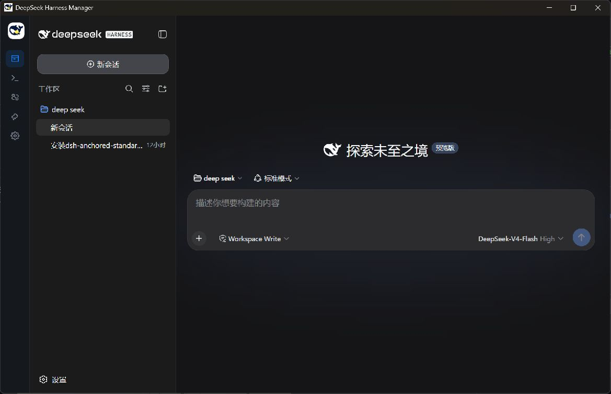
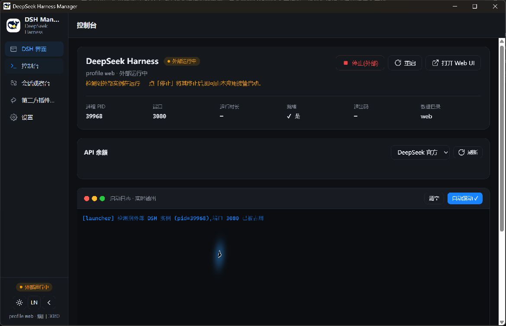
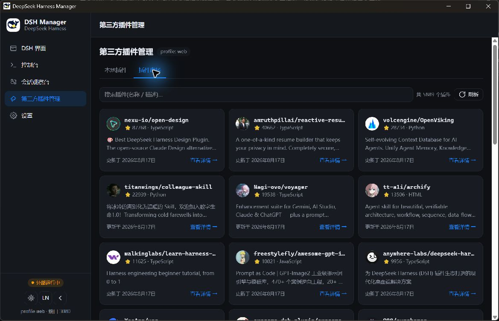
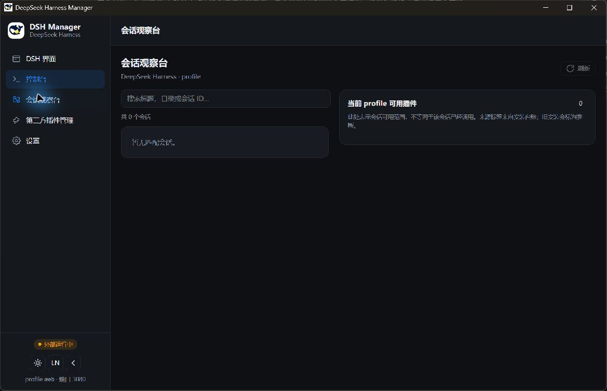

<div align="center">
  
  <h1>DeepSeek Harness Manager</h1>
  <p><strong>把 <code>npx @deepseek-ai/dsh web</code> 变成真正可以双击启动的 Windows 桌面软件。</strong></p>
  <p>自动启动或接管本机 DSH，在独立窗口中内嵌 Web UI，并提供会话观察、插件与代理预设管理、应用内更新、托盘运行、API 切换和安全诊断。</p>

  [](https://github.com/luocuiyu/deepseek-harness-manager/releases/latest)
  [](https://github.com/luocuiyu/deepseek-harness-manager/releases)
  [](LICENSE)
  
  

  [下载安装包](https://github.com/luocuiyu/deepseek-harness-manager/releases/latest) · [English](README.en.md) · [提交问题](https://github.com/luocuiyu/deepseek-harness-manager/issues)
</div>

> [!IMPORTANT]
> 本项目是独立社区项目，并非 DeepSeek 官方产品。项目基于 [MarcoG-h/DSH-Launcher](https://github.com/MarcoG-h/DSH-Launcher) 的 MIT 许可代码继续开发，完整归属见 [THIRD_PARTY_NOTICES.md](THIRD_PARTY_NOTICES.md)。

## 为什么需要它？

DeepSeek Harness 的 Web 模式通常需要先打开终端、执行 `npx @deepseek-ai/dsh web`，等待服务启动，再打开 `http://127.0.0.1:3080/`。终端窗口、浏览器标签页和 DSH 进程分散在不同位置，日常使用和故障排查都不够直观。

DeepSeek Harness Manager 将这些步骤收敛成一个桌面应用：

1. 双击桌面的蓝色鲸鱼图标。
2. 自动检测 3080 端口和已有 DSH 进程。
3. 没有运行实例时，自动执行等效于 `npx @deepseek-ai/dsh web` 的启动流程。
4. 已有实例时，识别为“外部运行中”，直接接入，不重复启动。
5. 端口就绪后，在应用自己的 Electron 窗口中内嵌 DSH。
6. 工作区和会话仍由 DSH 管理，可以在内嵌页面中自由切换。



## 实际界面

以下截图来自实际 Windows 安装版本，而不是设计稿；`v0.2.0` 在此基础上新增代理预设管理、软件回收站与应用内更新。

### 内嵌 DeepSeek Harness

DSH 通过 Electron 原生 `WebContentsView` 显示在应用内部。任务栏保留 Manager 自己的鲸鱼图标，不需要默认浏览器。



### 启动控制台

集中查看进程状态、PID、端口、就绪状态、API 余额与实时启动日志。检测到手动启动的 DSH 时会显示“外部运行中”。



### 插件市场

直接搜索 DeepSeek Harness 相关仓库，查看热度、语言和简介；支持 GitHub URL、本地路径和 npm 包名安装。



### 会话观察台

通过 DSH 的本地只读 API 汇总会话状态、工作目录、父子关系、代理预设，以及可用的 Token/上下文统计。



## 功能一览

| 模块 | 能力 | 说明 |
| --- | --- | --- |
| DSH 内嵌界面 | 原生子视图、自动进入、侧边栏联动 | 不打开外部浏览器，保持独立任务栏图标 |
| 进程控制 | 启动、停止、重启、进程树终止 | 避免残留 Node/DSH 子进程 |
| 外部实例识别 | 端口探测、PID 查询、自动接入 | 已经运行 `npx` 时不会再启动第二份 |
| 实时日志 | stdout/stderr、自动滚动、任务进度 | 启动失败时可以直接定位错误 |
| 会话观察 | 会话目录、运行状态、父子会话、代理预设 | 数据来自本机 DSH，只读展示 |
| 插件管理 | 安装、启用、停用、卸载、本地扫描 | 支持 GitHub、本地目录和 npm spec |
| 代理预设管理 | 扫描 `.agent-presets`、占用检测、打开目录 | 正确区分 Agent Preset 与第三方插件 |
| 软件回收站 | 恢复、冲突保护、永久删除 | 独立于 Windows 回收站，首次删除不会丢失文件 |
| 应用内更新 | 每次启动检查、版本提示、进度、重启安装 | 使用 GitHub Releases；下载和安装均由用户确认 |
| 插件市场 | 搜索、分页、README 预览、私有仓库 Token | GitHub 外部链接打开前会确认 |
| 来源追踪 | 官方、第三方、本地开发、用户安装、历史推断 | 同时标注 confirmed / inferred 可信度 |
| API 管理 | 多厂商预设、Base URL、API Key、余额查询 | 切换后随 DSH 重启注入 |
| 便携部署 | Node、npm、pnpm、DSH 一键安装 | 没有 Node.js 的 Windows 电脑也能使用 |
| 系统托盘 | 最小化到托盘、状态灯、单实例唤醒 | 再次双击快捷方式会显示已有窗口 |
| 故障诊断 | 脱敏配置、进程状态、会话概览、最近日志 | 报告不会包含 API Key 和 GitHub Token |

## 插件来源是怎样判断的？

Manager 会维护独立的插件安装台账，并结合 profile 中已有的依赖信息显示来源：

- `official`：`@deepseek-ai/*` 官方命名空间插件。
- `third-party`：通过 Manager 从 GitHub 仓库安装并确认来源。
- `local-development`：来自本机目录或 `file:` / `link:` 依赖。
- `user-installed`：通过 Manager 安装的 npm 包。
- `legacy`：安装发生在台账启用之前，只能根据现有配置推断。
- `unknown`：现有信息不足，避免给出不可靠结论。

> [!NOTE]
> 插件是当前 DSH profile 的“可用能力”，不代表某个会话已经实际调用过它。会话观察台会明确提示这个边界，不会把“可用”误报为“已使用”。

## 安装

### Windows 安装包（推荐）

1. 打开 [Releases](https://github.com/luocuiyu/deepseek-harness-manager/releases/latest)。
2. 下载最新的 `DeepSeek-Harness-Manager-<版本>-Setup.exe`。
3. 运行安装向导，选择安装目录。
4. 安装完成后，双击桌面或开始菜单中的鲸鱼图标。

当前社区预览版没有商业代码签名证书，Windows SmartScreen 可能显示“未知发布者”。请只从本仓库 Release 下载，并核对 Release 页面提供的 SHA-256。

### 已经安装 Node.js / npx

首次运行默认使用“本机 npx”模式，启动命令等效于：

```powershell
npx @deepseek-ai/dsh web
```

端口 3080 就绪后自动进入内嵌 DSH，不需要额外配置。

### 没有 Node.js

进入“设置 → DSH 下载 / 更新”，点击“快速离线部署”。Manager 会准备便携 Node、npm、pnpm 和 `@deepseek-ai/dsh`，完成后自动切换为内置运行环境。

## 三种运行模式

| 模式 | 适用场景 | 实际启动方式 |
| --- | --- | --- |
| 本机 npx | 已安装 Node.js，绝大多数用户 | `npx @deepseek-ai/dsh web` |
| 内置运行环境 | 不希望安装 Node，或需要便携部署 | Manager 管理的 Node + DSH |
| 源码模式 | 开发、调试或修改 DeepSeek Harness 源码 | 本机 Node 运行 Harness checkout |

## 配置与数据安全

| 数据 | 默认位置 / 处理方式 |
| --- | --- |
| Manager 普通配置 | Electron `userData/launcher-config.json` |
| API Key / GitHub Token | `safeStorage` 加密后写入 `launcher-secrets.bin`；Windows 使用 DPAPI |
| 插件来源台账 | Electron `userData/plugin-provenance.json` |
| 代理预设回收站 | Electron `userData/agent-preset-trash`；只有再次确认“永久删除”才清除 |
| DSH profiles / sessions / storage | 默认位于 `~/.dsh`，Manager 不会迁移或覆盖 |
| 本地插件目录 | 默认 `~/DSH-Plugin`，可以在设置中修改 |
| 诊断报告 | 由用户手动导出，秘密值替换为 `[configured]` |

应用启用了 Electron `contextIsolation`，渲染层通过受限 preload API 与主进程通信；外部链接不会在 Manager 主窗口中直接导航。

## 常见问题

<details>
<summary><strong>为什么显示“外部运行中”？</strong></summary>

说明 3080 端口已经存在 DSH，通常是之前手动执行的 `npx @deepseek-ai/dsh web`。Manager 会直接嵌入它；如果希望 Manager 完整接管，可先在控制台停止外部实例，再点击启动。
</details>

<details>
<summary><strong>关闭窗口后 DSH 为什么还在运行？</strong></summary>

默认启用了“关闭到托盘”。右键系统托盘鲸鱼图标并选择退出，或在设置中关闭该选项。是否在退出 Manager 时停止 DSH 可以独立配置。
</details>

<details>
<summary><strong>会不会破坏现有的 ~/.dsh？</strong></summary>

不会。Manager 默认复用现有 DSH_HOME。更新内置运行环境只更新 Manager 管理的运行文件，不覆盖 sessions、第三方插件台账或手动配置。
</details>

<details>
<summary><strong>插件为什么显示“历史安装·推断”？</strong></summary>

说明插件在来源台账建立之前就已存在。Manager 会根据包名和依赖 spec 推断来源，但不会伪装成已确认信息。通过 Manager 新安装的插件会记录为 confirmed。
</details>

<details>
<summary><strong>为什么 DSH 里能选择某个预设，插件页却显示 0？</strong></summary>

代理预设与第三方插件是两套机制。例如 `Anchored Standard` 位于 `DSH_HOME/.agent-presets`，不是当前 profile 的 npm 插件依赖。请进入“第三方插件管理 → 代理预设”查看、恢复或管理。
</details>

<details>
<summary><strong>软件更新会自动安装吗？</strong></summary>

不会。Manager 每次启动会自动检查 GitHub Releases，发现新版本后提示；下载和“重启并安装”都需要用户主动确认。选择“跳过此版本”后，只有出现更高版本才再次提示。
</details>

## 本地开发

需要 Node.js 22+ 与 pnpm：

```powershell
git clone https://github.com/luocuiyu/deepseek-harness-manager.git
cd deepseek-harness-manager
pnpm install
pnpm typecheck
pnpm dev
```

生成 Windows 安装包：

```powershell
pnpm dist
```

产物位于 `release/`。项目使用 hoisted pnpm 布局，以避免 Windows 深目录下 NSIS 构建命中 `MAX_PATH`。

## 技术栈

- Electron 43 + Electron Vite
- React 19 + TypeScript 7
- Tailwind CSS 4
- Electron `WebContentsView`
- Electron `safeStorage`
- NSIS / electron-builder

## 路线图

- [ ] 更完整的会话事件时间线与工具调用观察
- [ ] 插件安装前权限与变更预览
- [ ] 插件更新检查、回滚与快照
- [x] GitHub Releases 应用内更新（启动检查、下载进度、重启安装）
- [ ] 可验证的 Windows 代码签名
- [ ] 更多 DSH profile 管理能力
- [ ] macOS / Linux 适配评估

欢迎通过 [Issues](https://github.com/luocuiyu/deepseek-harness-manager/issues) 提交问题、建议和兼容性反馈。

## 许可证与归属

本项目以 [MIT License](LICENSE) 开源。

上游 DSH Launcher、DeepSeek Harness、DeepSeek 名称和相关标识的归属说明见 [THIRD_PARTY_NOTICES.md](THIRD_PARTY_NOTICES.md)。DeepSeek 和 DeepSeek Harness 相关商标归其各自权利人所有。
